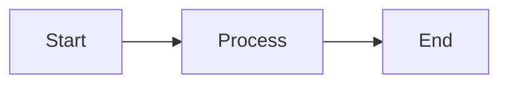

# Generate Slide Deck

## Overview

Technical reference for writing Slidev slide decks from project documents.
Covers syntax, components, file placement, and common mistakes. The
`slide-deck-author` agent handles the synthesis approach and workflow; this
skill is the implementation reference it uses.

**Stack:** Slidev (`@slidev/cli` + `@slidev/theme-default`). Write markdown; no
Vue knowledge required.

## Setup

### Installation

Before generating a deck, verify Slidev is installed in the project:

```bash
npx slidev --version
```

If not installed, first check which package manager the project uses — look for
a lockfile (`pnpm-lock.yaml` → pnpm, `bun.lockb` → bun, `yarn.lock` → yarn,
`package-lock.json` → npm) or a `packageManager` field in `package.json`. Use
whatever the project already uses, not a default assumption.

```bash
# npm
npm install -D @slidev/cli @slidev/theme-default

# pnpm
pnpm add -D @slidev/cli @slidev/theme-default

# yarn
yarn add -D @slidev/cli @slidev/theme-default

# bun
bun add -D @slidev/cli @slidev/theme-default
```

### Launching a Deck

```bash
npx slidev <path-to-slide-file>.md
```

This starts a dev server at `localhost:3030`. Navigate with arrow keys or
on-screen buttons. Stop with `Ctrl+C`.

## Starter Template

Copy `templates/slides.md` as your starting point. It includes:

- Frontmatter (theme, color scheme)
- Title slide pattern
- Content slide pattern
- Mermaid diagram slide pattern
- `MultiChoice` decision slide pattern
- `FeedbackSummary` final slide

## Slide Structure

### Slide separators

Use `---` on its own line to separate slides. Each slide is a standalone
markdown section.

### Frontmatter

Every deck starts with a frontmatter block:

```yaml
---
theme: default
title: <Deck Title>
colorSchema: dark
highlighter: shiki
---
```

### Typical deck structure

For a proposal or dev plan, aim for 8–12 slides:

1. **Title** — document name, one-line summary
2. **Problem** — what this solves and why it matters
3. **Approach** — high-level solution, 3–5 bullets
4. **Key decisions / trade-offs** — what was weighed, what was chosen
5. **Scope** — what's in, what's explicitly out
6. **Architecture / flow** — Mermaid diagram if relationships matter
7. **Risks** — top 2–3 concerns
8. **Open questions** (if any) — `MultiChoice` slides for each decision point
9. **Feedback Summary** — always last if decision slides are present

For an investigation, aim for 6–8 slides: question, context, candidates,
findings, comparison table, recommendation.

## Cover Images

For the title slide, a background image from Unsplash can set the tone for the
deck. Use Slidev's `layout: cover` with a `background` URL:

```yaml
---
layout: cover
background: https://images.unsplash.com/photo-<id>?w=1920&auto=format&fit=crop&q=80
---
```

**Choosing an image:** Search [unsplash.com](https://unsplash.com) for a keyword
matching the deck topic. Open the photo, copy the URL from the browser address
bar, and extract the `photo-<id>` portion. Replace with the Unsplash CDN format
above.

**Dimming for readability:** Add a `<style>` block below the slide content to
overlay a semi-transparent dark layer so text stays readable:

```markdown
# Deck Title

One-line summary

<style>
.slidev-layout.cover { position: relative; }
.slidev-layout.cover::before {
  content: '';
  position: absolute;
  inset: 0;
  background: rgba(0, 0, 0, 0.55);
  z-index: 0;
}
.slidev-layout.cover > * {
  position: relative;
  z-index: 1;
}
</style>
```

Adjust the `rgba` alpha value (0.4–0.65) to taste. Keep cover images to the
title slide only — background images on content slides increase visual noise and
make text harder to read.

## Mermaid Diagrams

Mermaid works natively — just write a standard fenced code block:

````markdown

````

Keep diagrams simple — 5–8 nodes max on a single slide. Avoid detailed UML;
prefer flowcharts and sequence diagrams that communicate relationships quickly.

## Decision Slides (MultiChoice)

When a document has open questions or options to choose between, use the
`MultiChoice` component. Agents write this directly in the markdown — no Vue
knowledge needed:

```markdown
# Decision: <Question Title>

<MultiChoice
  id="unique-id"
  question="<The question being decided>"
  :options="[
    'Option A description',
    'Option B description',
    'Option C description'
  ]"
/>
```

Rules:

- `id` must be unique across all slides in the deck
- 2–4 options per question; more than 4 gets hard to read
- Keep option text concise — one sentence max
- One decision per slide

## Tell Me More

Use `TellMeMore` pills on any slide where the synthesized content might leave
the reviewer wanting to go deeper on a specific aspect. The reviewer clicks to
flag it; clicking again removes the flag. All flags appear in the
`FeedbackSummary` report under a "Want to Know More" section.

```markdown
<TellMeMore id="unique-id" topic="Concise description of what they want to explore" />
```

Typical placement: at the bottom of a content slide as optional depth signals,
or grouped on a standalone "Open Questions" slide:

```markdown
# Open Questions

<TellMeMore id="cost-model" topic="How does the pricing model scale at 10k users?" />
<TellMeMore id="migration-risk" topic="What's the risk of the data migration step?" />
<TellMeMore id="fallback-plan" topic="What's the fallback if the third-party API is down?" />
```

Rules:

- `id` must be unique across the deck
- `topic` should be a plain-language question or phrase — write it as the
  reviewer would say it, not as a section title
- Don't overload slides with pills — 2–3 per slide max, grouped where they're
  relevant

## Feedback Summary Slide

Always include this as the final slide when decision slides are present:

```markdown
# Feedback Summary

Your selections — save or copy to send back to the agent.

<FeedbackSummary />
```

The `FeedbackSummary` component:

- Reads all `MultiChoice` selections from the session
- Renders them as formatted markdown
- Provides a "Save feedback.md" button (File System Access API on Chromium,
  download fallback on other browsers)
- Provides a "Copy to clipboard" button as secondary option

## Vue Components

The skill includes two reusable Vue components in `components/`. Slidev
auto-imports them — agents reference them by name in markdown, no imports
needed.

| Component         | Purpose                                                                  |
| ----------------- | ------------------------------------------------------------------------ |
| `MultiChoice`     | Decision slide with clickable options, persists to localStorage          |
| `TellMeMore`      | Inline pill the reviewer clicks to flag a topic for follow-up            |
| `FeedbackSummary` | Aggregates all decisions and "tell me more" flags, save/copy to markdown |

Both components use CSS custom properties keyed to `:root.dark` — they
automatically adapt when Slidev's color scheme is toggled (press `D` in the
browser). No configuration needed.

To add components to a project's slide deck, copy the `components/` folder
alongside the slide `.md` file:

```
docs/projects/<name>/artifacts/
  slides.md
  components/
    MultiChoice.vue
    FeedbackSummary.vue
```

Slidev automatically picks up components from a `components/` directory next to
the entry file.

## File Location

**Active project exists** — put slides in the project's artifacts folder and
commit the `.md` source:

```
docs/projects/<name>/artifacts/<feature>-slides.md
docs/projects/<name>/artifacts/components/   ← copy from skill if using MultiChoice/TellMeMore
```

**No project yet** (investigation, brief, or early exploration) — slides are
temporal. Create them in a root-level `artifacts/` folder named after the topic:

```
artifacts/<topic-name>/slides.md
artifacts/<topic-name>/components/
```

The `artifacts/` root folder is ephemeral — don't commit it unless it's
genuinely useful to preserve. Add it to `.gitignore` if the project accumulates
many throwaway decks.

Commit the `.md` source. Never commit the rendered dev server output.

## Key Conventions

**Density** — One idea per slide. If a slide needs more than 5–6 bullets, split
it. The goal is quick comprehension, not completeness.

**No implementation detail** — Slides are for review, not specification. Leave
technical specifics in the source document.

**Dark theme default** — `colorSchema: dark` matches the project's html-mockup
prototyping conventions. Adapt if the project uses a light theme.

**State persistence** — `MultiChoice` selections persist in `localStorage` for
the session. Navigating away and back preserves selections. Refreshing the page
clears them.

## Common Mistakes

- **Too much text per slide** — If it looks like a document, it's not a slide.
  Cut ruthlessly; every bullet should earn its place.
- **Skipping the FeedbackSummary** — If you added decision slides, always end
  with `<FeedbackSummary />`. Otherwise selections have nowhere to go.
- **Duplicate `MultiChoice` ids** — Each `id` must be unique. Duplicate ids
  cause selections to overwrite each other in localStorage.
- **Writing Vue component syntax for content** — Don't use Vue components for
  regular content slides. Only `MultiChoice` and `FeedbackSummary` need
  component syntax; everything else is plain markdown.
- **Forgetting `components/` folder** — Slidev only auto-imports components from
  a `components/` directory adjacent to the entry `.md` file. Copy the folder
  alongside the slide source, not in a parent directory.
- **FeedbackSummary overflow** — When there are more than 3–4 decisions plus
  multiple `TellMeMore` flags, the summary slide content will push below the
  visible slide area. Slidev slides are fixed height and don't scroll. This is a
  known constraint — limit decision slides to questions that genuinely need a
  choice, not every open question in the document.
