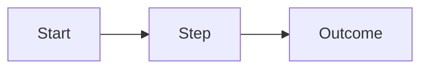

# [Document Title]

[One sentence: what this document is and why it matters]

---

# Problem

[What problem does this solve? Who's affected?]

- [Pain point 1]
- [Pain point 2]
- [Pain point 3]

---

# Approach

[High-level solution — 3–5 bullets]

- [Key component or decision 1]
- [Key component or decision 2]
- [Key component or decision 3]

---

# Scope

**In:** [What's included]

**Out:** [What's explicitly excluded]

**Later:** [Future considerations]

---

# Architecture / Flow

[Use this slide when relationships or sequences matter more than a bullet list.
Delete if not needed.]

---

# Risks

[Top 2–3 concerns and mitigations]

- **[Risk 1]** — [mitigation]
- **[Risk 2]** — [mitigation]

---

# Decision: [Question Title]

[Use this slide for each open decision point. Delete if no decisions needed.]

<MultiChoice
  id="decision-1"
  question="[The question being decided]"
  :options="[
    'Option A — description',
    'Option B — description',
    'Option C — description'
  ]"
/>

---

# Feedback Summary

Your selections — save or copy to send back to the agent.

<FeedbackSummary />
