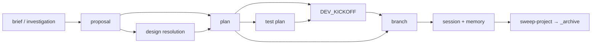
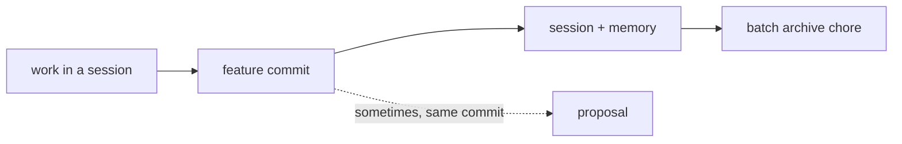
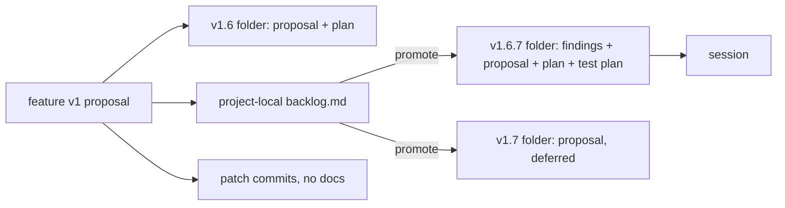
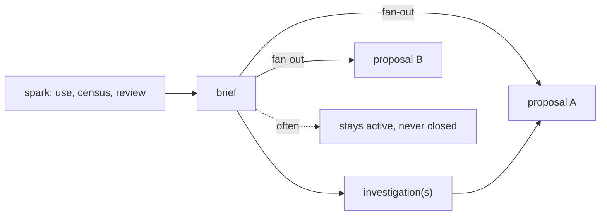
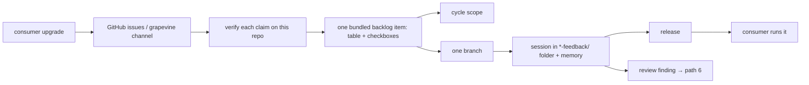
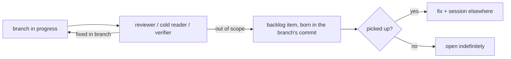
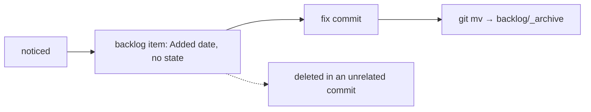

# Archaeology: How Work Actually Arrives and Moves in project-docs

## Metadata

- **Report Type:** Architecture assessment (process archaeology)
- **Scope:** This repository's `docs/` tree and `git log` (531 commits,
  2025-10-08 → 2026-09-22), plus a read-only look at story-loom's `docs/`.
- **Feeds:**
  `docs/investigations/2026-09-22-work-taxonomy-for-agent-first-development-investigation.md`,
  Next Step 2 ("map the work flows from this repository's own history").
- **Method:** Birth dates from `git log --name-status --diff-filter=A -- docs/`;
  deaths and moves from `--diff-filter=DR`; frontmatter `lifecycle` read from
  the files; first paragraphs only. The process described in `README.md` and
  `SCHEMA.md` was not used as evidence.

**One caveat on dates.** Most branches here land as a single squashed or
consolidated commit. A proposal and its session born in the same commit
therefore do _not_ prove the proposal was written after the work — only that the
order is not recoverable from `develop`. Where this matters it is flagged.

---

## Executive Summary

**Key findings:**

- Work arrived by **nine distinct paths**. Only one of them (the shaped feature)
  follows the brief → investigation → proposal → plan → session pipeline the
  manifesto describes, and even there several instances wrote the whole chain in
  one commit.
- The **most common shape is record-first**: 16 project folders hold sessions
  and no proposal, and 17 of the 31 proposals were first committed together with
  the code they describe. The tree has mostly been a record of work, not a queue
  of it.
- **Closure is the weakest step in every era.** At least six live documents
  carry a state their own evidence contradicts (a brief saying "nothing was
  built" for a skill that shipped in the same commit; a backlog item open for a
  capability `docs-foundation` shipped; a cycle still `active` eight days after
  its last branch landed).
- The owner's "proposals → backlog items" shift is real but is mostly a **shift
  in the kind of work**, not only in practice: new capabilities (spells,
  recipes, doc types) came through proposals; once story-loom and Spellbook
  adopted 8.x in September, consumer-driven fixes and review follow-ups arrived
  as backlog items. Foundational features in September still got full proposals,
  plans, test plans and a kickoff.
- **Fragments were never used** in this repository (zero ever committed) nor in
  story-loom. Raw capture happens outside the tree — Operator, GitHub issues, a
  grapevine channel — and enters already partly shaped.

**What the candidate taxonomy needs to add** (detail in the last section): a
"landed but not yet released / verified downstream" state; a provenance link
(`from` / discovered-from) separate from `parent`; an `external` reference for
issues and captures; an allowed "record-first" item created already done; and a
long-lived parent for features that keep shipping versions.

---

## The nine paths

| #   | Path                                    | Typical documents, in order                                                                                     | Frequency (evidence)                                                                     | How it closes                                                                          | Fit with candidate                                         |
| --- | --------------------------------------- | --------------------------------------------------------------------------------------------------------------- | ---------------------------------------------------------------------------------------- | -------------------------------------------------------------------------------------- | ---------------------------------------------------------- |
| 1   | Shaped feature                          | brief or investigation → proposal → [design resolution] → plan → [test plan] → [kickoff] → session + memory     | 12 project folders with proposal and plan                                                | proposal `implemented`, plan `completed`; archived by `sweep-project` since 2026-08-07 | Clean: feature = proposal, children optional               |
| 2   | Ship-then-record                        | code → session (+ memory), sometimes a proposal in the same commit                                              | 16 sessions-only folders; 17 of 31 proposals first committed with code                   | Never explicitly; archived in batch chores                                             | Strains: an item must exist before work                    |
| 3   | Versioned iteration of a living feature | per-version folder (proposal, plan, test plan) + a project-local backlog; patches with no docs                  | grapevine (5 folders), finalize-branch-hardening, html-mockup (3 folders)                | Per version; the feature itself never closes                                           | Strains: features are outcome-bound and close              |
| 4   | Idea development (discovery)            | brief (workshop) → investigation(s) → maybe proposal(s)                                                         | 10 briefs (1 lost), 9 investigations (1 lost)                                            | Briefs rarely: 2 `spent`, 7 `active`, `_archive/` empty                                | Strains: a document with nothing yet to attach to          |
| 5   | Consumer feedback round                 | issues / channel → verification → one bundled backlog item → cycle → branch → session in a `*-feedback/` folder | 2 rounds in 8 days (story-loom, Spellbook), earlier ad hoc cases                         | Checkboxes ticked; state waits on release or on the consumer                           | Mostly clean; missing "released" state and external IDs    |
| 6   | Review or dogfood finding → follow-up   | backlog item born inside another branch's commit                                                                | 8 items 2026-09-02 → 09-17                                                               | 2 done, 6 still open                                                                   | Clean as a work item; needs a discovered-from link         |
| 7   | Small fix captured as a list item       | backlog item (`**Added:**` prose, no state) → fix → `git mv` to `_archive/`                                     | 7 items Feb–Mar 2026                                                                     | Moved to `_archive/` in the fixing commit, or deleted                                  | Clean: a work item going backlog → done                    |
| 8   | Chore, release, self-migration          | commit only                                                                                                     | 66 release commits, 33 non-release `chore` commits                                       | The commit                                                                             | Out of scope; should stay so                               |
| 9   | External capture                        | Operator folder or GitHub issue → (sometimes) a repo document                                                   | Issues #108, #140, #145, #163–171, #172, #176 in commit subjects; Operator by skill only | Outside the repo                                                                       | Not covered: triage state exists, but no external identity |

Frequencies count documents or folders, not effort. The paths overlap: path 5
feeds path 6, path 4 feeds path 1.

---

### Path 1 — Shaped feature (the pipeline as designed)



**dev-kickoff (2 days, backlog-born).** Backlog item
`docs/backlog/_archive/2026-03-01-explore-agent-orchestration-patterns.md`
(`59ca0f5`, 03-01) → proposal (`5809daf`, 03-03) → plan (`32fa00e`, 03-03) →
skill and session (`10eb19f`, 03-03), which also moved the backlog item to
`_archive/` → project archived in a batch chore (`c2520a3`, 03-05). A research
backlog item became a feature; nothing links the two except the commit.

**okf-frontmatter-layer (6 weeks, brief-born, with a stall).** Brief
`docs/briefs/2026-07-23-knowledge-wiki-layer.md` (`c818fbd`, 07-23) → two
investigations the same day (`e33defb`, `a9638bb`; both `concluded`) → **six
weeks with no commits on the thread** → investigation
`2026-09-03-work-cycle-taxonomy-landscape-investigation.md`, two landscape
reports and the proposal in one commit (`f4a6ab0`, 09-03) → plan (`523eb7c`,
09-04) → cycle `docs/cycles/2026-09-okf-frontmatter-layer.md` and code
(`2bb3cfe`, 09-04) → session and memory (`60fbc34`, 09-04). Brief `spent`,
proposal `implemented`, plan `completed`, cycle `closed` with a written outcome.
The one fully closed chain in the tree.

**migration-shape (1 day, brief-born from a review).** Brief
`docs/briefs/2026-09-12-migration-shape.md` (`45be710`, 09-12; its spark is
three review rounds on one migration) → proposal, brief marked `spent`
(`63f0b3b`) → plan (`087c4ed`) → `DEV_KICKOFF.md` (`acd9ae6`, 09-13) → session
and memory (`748c363`, 09-13).

**Variants.** `docs/projects/sweep-project/` has an investigation first
(`5298cf7`, 08-07) and then proposal, plan and session in one commit (`0baf1cf`,
same day) — the pipeline documents exist, but the squash hides whether they
gated the work. `docs/projects/docs-foundation/` split from one brief into two
proposals (`1c26f12`, 09-11), got plan and test plan the same day, and landed
(`c7b17be`, 09-12); its proposal and plan are still `lifecycle: draft` although
`sessions/2026-09-12-docs-foundation.md` says all four planned phases shipped.

### Path 2 — Ship-then-record



- **Sessions-only folders (no proposal, no plan):** `toolbox-plugin` (`dde6289`,
  `95a5f50`), `agent-bridge-plugin` (`d7f88bf`), `project-cli-toolkit-recipe`
  (`cc23f02`, `7c809dc`), `digestify-session-recovery` (`bd1bfc8`), and in
  `_archive/`: `install-to-current-directory`, `generalize-worktree-scripts`,
  `migration-scripts`, `media-library-recipe`, `html-mockup-skill-improvements`
  and others — 16 in all. The folder exists only to hold the record.
- **Proposal, session and memory in one commit:** `digestify` (`6bdf38b`,
  05-07), `tusk-board` (`919b08d`, 05-24, with three `reviews/` and a pre-ship
  review report), `moodboard-element-extraction` (`9a85985`, 05-24: the
  investigation, three proof-of-concept findings, the proposal and the session
  all at once). Squash caveat applies.
- **digestify's real history** is spread across three pipelines: an
  investigation `2026-03-05-interactive-doc-review-tool.md` (`86d5691`, later
  deleted — see below), a third-party skill's spec and plan in
  `docs/superpowers/specs/2026-05-05-doc-review-design.md` and
  `docs/superpowers/plans/2026-05-06-doc-review.md` (`ee67e8d`), and then the
  project folder. Nothing links them.

Closure: no state until the September backfill (`ada5b7e`) gave the proposals
`implemented`; archiving happened in batch chores (`3d87b7c` 03-08, `eca0d03`
03-11, `b363d19` 03-19) and, since 08-07, by `sweep-project`.

### Path 3 — Versioned iteration of a living feature



- **grapevine:** `projects/grapevine/proposal.md` (`0ad67c2`, 05-25) →
  `grapevine-v1.6/` proposal and plan (`543ff9e`, 05-27; proposal later
  `superseded`, plan left `draft`) → `grapevine-backlog/backlog.md` and
  `grapevine-v1.7/` (`14da7a5`, 05-27; v1.7 `deferred`) → `grapevine-v1.6.7/`
  with `roundtable-findings.md`, proposal, plan and test plan (`9969e2f`,
  05-28), session (`cc355ad`, 05-28) → V1.6.2, V1.6.3, V1.6.5, V1.6.8 as commits
  with no documents (`c639ec9`, `1a8c5f5`, `93879ce` #140) → extracted to
  Spellbook (`29cc605`, 06-11). The backlog file (type `artifact`) says in its
  own words: "When an item is ready to be promoted, it moves to a versioned
  project folder … and gets a real proposal."
- **finalize-branch-hardening:** three sessions, no proposal (`5298cf7` 08-07,
  `e945236` and `3002654` 09-02). Its driver was a backlog item
  (`docs/backlog/_archive/2026-08-10-code-review-subagent-needs-execution.md`,
  "recurring feedback from agents").
- **html-mockup:** `html-mockup-prototyping-upgrade`,
  `html-mockup-skill-improvements`, `html-mockup-component-updates` — three
  folders for one skill in eight days (`447ef49` 03-11 → `5a37add` 03-19).

The feature is a long-lived area; each version is the outcome-bound unit.

### Path 4 — Idea development (discovery)



State of every brief ever committed:

| Brief (`docs/briefs/`)                          | Lifecycle | What actually happened                                                                                                                        |
| ----------------------------------------------- | --------- | --------------------------------------------------------------------------------------------------------------------------------------------- |
| `2026-03-05-doc-to-presentation-system.md`      | —         | Deleted in `b49ce51`; re-captured as `2026-03-13-markdown-slide-decks.md` (similar subject)                                                   |
| `2026-03-11-improve-skill-and-recipe-workflows` | active    | No follow-on document; the feedback route it asks for arrived as `report-issue` (`61dc573`)                                                   |
| `2026-03-11-ui-experimentation-framework`       | active    | Nothing followed                                                                                                                              |
| `2026-03-13-markdown-slide-decks`               | active    | Investigation and shipped skill the same day (`508adf5`, `fefa720`); proposal `implemented`                                                   |
| `2026-04-13-report-issue-skill`                 | active    | Skill shipped in the **same commit** (`61dc573`), renamed `provide-feedback` (`1fe3f8d`, 06-30); frontmatter comment says "nothing was" built |
| `2026-07-10-hivemind-playbook-catalog`          | active    | Committed 07-23 (`0f8b6cd`); no follow-on                                                                                                     |
| `2026-07-23-knowledge-wiki-layer`               | spent     | Path 1, okf-frontmatter-layer                                                                                                                 |
| `2026-09-11-guidance-layer-and-touch-points`    | active    | Fanned out into two proposals (`1c26f12`); one shipped, one (`guidance-lifecycle`) waits on this taxonomy                                     |
| `2026-09-12-migration-shape`                    | spent     | Path 1                                                                                                                                        |
| `2026-09-14-lint-beyond-the-docs-root`          | active    | Spark is story-loom's upgrade; no follow-on yet                                                                                               |

Investigations follow the same pattern: of nine ever committed, one was lost
(`2026-03-05-interactive-doc-review-tool.md`, `b49ce51`), one is `active` though
its feature shipped the day it was written
(`2026-02-25-cross-agent-skill-portability.md`, `b3640c6`), and four fed a
single proposal each (slide decks, moodboard, sweep-project, okf). Two briefs
(guidance, wiki) and one investigation (this taxonomy) feed **several** features
— a relation `parent` cannot express.

Story-loom shows the discovery phase at a larger scale: five briefs written in
two days for a new project (`story-loom/docs/briefs/_archive/2026-03-17-…` to
`2026-03-18-…`), all archived.

### Path 5 — Consumer feedback round



**Story-loom round 1 (same day).** Issues #163–171 → both backlog items and the
cycle `docs/cycles/2026-09-story-loom-feedback.md` in one commit (`7bee2ee`,
09-14) → fixes and session
`projects/story-loom-feedback/sessions/2026-09-14-round-1-nine-fixes.md`
(`8253db9`) → migration session (`9537d93`) → PR #172 (`52b3266`). The round-1
item is `done`; `2026-09-14-v2.9-to-v2.10-refresh-the-owned-files.md` is still
`open` although its migration landed in `9537d93`, because the cycle's appetite
is "until story-loom has run v2.10".

**Spellbook round 1 (two days, then a spin-off).** Issue #176 fixed (`cce845e`)
with its own session (`09da73a`, 09-15) → eleven more items sent over the
grapevine channel `spellbook-upgrade` → one item
`docs/backlog/2026-09-15-spellbook-feedback-round-1.md` (`cb00849`) attached to
the _story-loom_ cycle → branch and session (`3c8e927`, 09-17), which ticks
every checkbox and adds "The release is what remains" — so it stays `open` → the
reviewer's finding becomes a new item (`be9a4fd`) → fixed (`719d647`, 09-22).

**Earlier, unbundled cases.** `docs/projects/api-mcp-desktop-gotcha/` (a gotcha
found debugging another project; proposal, session and memory in `610bc13`,
04-16); `agent-surface-recipe-evolution` (issue #145 → proposal, resolved
questions, plan, session, all 06-16); brief
`2026-03-11-improve-skill-and-recipe-workflows.md`, whose spark is "working in
another project … the path to actually making those improvements was ad hoc".

Observations: the backlog item here is a **bundle of external issues sized to a
branch** ("They are one item because they ship together: one branch, one plugin
bump, one release"). The `*-feedback/` project folder holds only sessions. The
story-loom cycle became a rolling consumer-feedback lane: its scope now lists
Spellbook and hook-env items, and it is `active` with `## Outcome` still
"_Written at close._" eight days after its last branch.

### Path 6 — Review or dogfood finding becomes follow-up work



| Item (`docs/backlog/`)                                     | Born in                                   | Now                                                                            |
| ---------------------------------------------------------- | ----------------------------------------- | ------------------------------------------------------------------------------ |
| `2026-09-02-sweep-project-archive-internal-link-exception` | `ca0bb1c` (sweep generalisation)          | `done`, via the okf cycle                                                      |
| `2026-09-02-sweep-project-reference-boundary-gaps`         | `ca0bb1c`                                 | open                                                                           |
| `2026-09-02-finalize-branch-step-2-density`                | `e945236` (reviewer gate)                 | open                                                                           |
| `2026-09-02-task-agent-tool-name-drift`                    | `e945236`                                 | open                                                                           |
| `2026-09-02-root-level-conventions-check-semantics`        | `bfd00c9` ("surfaced by the cold reader") | open                                                                           |
| `2026-09-04-plugin-skills-hardcode-flat-docs-paths`        | `60fbc34` (okf session)                   | open                                                                           |
| `2026-09-04-user-defined-document-types`                   | `1dde782` (pdocs CLI)                     | open — though `f327151` shipped "a project can declare its own document types" |
| `2026-09-17-check-inherits-git-hook-variables`             | `be9a4fd` (Spellbook review)              | `done` in 5 days (`719d647`)                                                   |

Related shapes that stayed inside their branch: tusk-board's `reviews/` folder
and `docs/reports/2026-05-22-tuskboard-skill-pre-ship-review.md`; grapevine
v1.6.7's `roundtable-findings.md`, which _scoped_ a version (path 3). Story-loom
does the same thing heavily:
`story-loom/docs/backlog/2026-04-16-mcp-auth-refactor-followups.md` ("surfaced
by code review on `fix/mcp-claude-desktop-support`"), 23 open items and 37
archived.

### Path 7 — Small fix captured as a list item (early backlog)



- `2026-03-01-fix-lowercase-skill-filenames.md`,
  `2026-03-01-standardize-skill-descriptions.md`,
  `2026-03-01-overhaul-mobile-test-skill.md`: born 03-01 (`90d1b08`), each fixed
  and archived the same day (`e670d8c`, `a3cbbae`, `575f908`).
- `2026-02-15-rename-skills-to-generate-convention.md`: born `80aebe3` (02-15),
  archived with the filename fix 14 days later (`e670d8c`).
- `2026-03-03-recipes-plugin-vs-mcp-server.md`: deleted the day it was born, in
  a recipe feature commit (`5ed28f7`), no record of the decision.

After 2026-03-05 no top-level backlog item was born until 2026-09-02 — six
months in which the only backlog was grapevine's project-local file.

### Path 8 — Chore, release, self-migration

Commit-only. 66 release-please commits; ~40 `chore` commits such as the
`package-lock.json` removals (03-13), the Bun prerequisite bump (`2026-05-27`,
grapevine V1.6.5), applying a migration to this repo's own docs (`4d2c15d`), and
batch archive commits. Dependency updates as such are almost absent from the log
despite an `update-deps` command. Nothing here produced a document, and nothing
seems to have needed one.

### Path 9 — External capture

- **Operator.** `plugins/operator/skills/operator-triage/SKILL.md` routes
  Operator folders ("bugs, fragments, on-deck") into investigation, proposal,
  fragment or backlog; the manifesto lists it (`docs/PROJECT_MANIFESTO.md`,
  operator plugin). The investigation's Decision 2 records that "ideas were
  captured in Operator". The repo has no document that names an Operator source,
  so which items came this way is not recoverable.
- **Fragments: zero.** `docs/fragments/` has held only `README.md` and
  `TEMPLATE.md` since the type was added (`b94b52b`, 2025-11-11); no fragment
  appears in the birth log. Story-loom's `fragments/` is the same.
- **GitHub issues.** Referenced from commits: #108 (`11ea494`), #140
  (`93879ce`), #145 (six commits, 06-16), #163–171 and #172, #176. Only #145 and
  the two consumer rounds produced repo documents; #108 and #140 are commits
  only.
- **Captured before git.**
  `docs/backlog/_archive/2026-08-10-code-review-subagent-needs-execution.md` is
  dated 08-10 but first committed on 09-02, straight into `_archive/`, in the
  commit that fixed it (`e945236`).

### Anomaly — work lost without a record

`b49ce51` (03-08, subject "recipe: add agent-feedback-reporting recipe skill")
deleted the whole `projects/migration-script-improvements/` folder (proposal,
plan, `DEV_KICKOFF.md`, session — the only kickoff before September), the
investigation `2026-03-05-interactive-doc-review-tool.md`, the brief
`2026-03-05-doc-to-presentation-system.md`, the backlog item
`2026-03-05-co-locate-source-docs-when-archiving-projects.md`, and moved ten
archived files back out of `_archive/` (re-archived by `3d87b7c` the same day).
None of the deleted files was restored. The co-locate idea resurfaced five
months later as
`docs/investigations/2026-08-07-project-closure-and-archive-touchpoint-investigation.md`.

---

## Evolution over time

| Era                                  | Dates                | Typical flow                                                                                                                                                                                                        | Evidence                                                                                                                      |
| ------------------------------------ | -------------------- | ------------------------------------------------------------------------------------------------------------------------------------------------------------------------------------------------------------------- | ----------------------------------------------------------------------------------------------------------------------------- |
| A. Scaffold only                     | 2025-10 → 2026-02-08 | Work on the template; almost no documents about this repo's own work                                                                                                                                                | First `docs/` births are `e03568d` (02-09)                                                                                    |
| B. Project folder as record          | 2026-02-09 → 2026-03 | Ship, then a session in a project folder; proposals mostly for new doc types and UI references; backlog as a fix list; batch archiving                                                                              | Flat `proposals/` → `projects/` (`da9d5d1`); 27 sessions and 7 backlog items born Feb–Mar; archive chores                     |
| C. Ship-and-record, per version      | 2026-04 → 2026-06    | Proposal + session + memory in the feature commit; version folders; project-local backlog; third-party spec folders; top-level backlog dormant                                                                      | 11 proposals born in May; grapevine family; `docs/superpowers/`; no backlog births 03-05 → 09-02                              |
| D. Discovery lull                    | 2026-07 → 2026-08    | Briefs and investigations; closure gets a skill                                                                                                                                                                     | 11 commits in two months; `sweep-project` (`0baf1cf`) archives the first projects by skill                                    |
| E. Stateful items, cycles, consumers | 2026-09              | Frontmatter `lifecycle` on everything; cycles; backlog items as branch work orders with acceptance checkboxes; consumer rounds; full pipeline (with test plan and kickoff) reserved for foundational infrastructure | `2bb3cfe` (SCHEMA, cycle type), backfill `ada5b7e`; 12 backlog items, 13 sessions, 12 memories, 5 proposals born in September |

Document births by month (from the birth log; plans include
`docs/superpowers/plans/`):

| Month   | Proposals | Plans | Backlog | Briefs | Investigations | Sessions | Cycles |
| ------- | --------- | ----- | ------- | ------ | -------------- | -------- | ------ |
| 2026-02 | 4         | 5     | 1       | 0      | 1              | 8        | 0      |
| 2026-03 | 8         | 2     | 6       | 4      | 2              | 19       | 0      |
| 2026-04 | 2         | 0     | 0       | 1      | 0              | 3        | 0      |
| 2026-05 | 11        | 5     | 1       | 0      | 1              | 8        | 0      |
| 2026-06 | 2         | 1     | 0       | 0      | 0              | 2        | 0      |
| 2026-07 | 0         | 0     | 0       | 2      | 2              | 0        | 0      |
| 2026-08 | 1         | 1     | 0       | 0      | 1              | 2        | 0      |
| 2026-09 | 5         | 5     | 12      | 3      | 1              | 13       | 2      |

**Reading the shift.** The move from proposals to backlog items lines up with
two events: the frontmatter layer (09-04), which gave backlog items a state and
acceptance checkboxes worth tracking, and the first consumers adopting 8.x
(09-14, 09-15), which turned the incoming work from "new capability" into
"verified defect in shipped capability". September still produced five proposals
— for foundational work (`project-docs-cli`, `docs-foundation`,
`guidance-lifecycle`, `migration-shape`, `okf-frontmatter-layer`) — and they got
more ceremony than any earlier era (test plans, kickoffs, design resolution).
The practice did not abandon proposals; it stopped using them for small or
externally sourced work.

Story-loom, a product rather than a toolkit, shows where the practice heads
under sustained use: backlog-heavy (22 of 23 live items `open`, 37 archived,
born Mar–Sep), multiple phase plans per feature
(`story-loom/docs/projects/mcp-storyline-authoring/plan-p2-authoring.md`,
`plan-p3-context-parity.md`), a cycle whose scope is a whole project
(`story-loom/docs/cycles/2026-09-navigable-context.md`), and "horizon note"
backlog items that are roadmap entries, not tasks
(`story-loom/docs/backlog/2026-06-28-mcp-full-capability-parity.md`).

---

## Mapping onto the candidate taxonomy

The candidate (investigation, "Candidate taxonomy" and "Decisions so far"): one
work-item entity with `state` and `parent`; a feature that _is_ its proposal
(pitch-as-unit); documents attached; records attached by link; cycle as a
grouping; backlog and board as derived views.

| Path                      | Where it fits                                                                                                         | Where it strains                                                                                                                                                                    |
| ------------------------- | --------------------------------------------------------------------------------------------------------------------- | ----------------------------------------------------------------------------------------------------------------------------------------------------------------------------------- |
| 1 Shaped feature          | Proposal = feature with state; plan, test plan, design resolution, kickoff as attached documents; sessions as records | Plan steps as checklist is fine here (Decision 3). A brief or investigation that preceded the feature has no parent to attach to.                                                   |
| 2 Ship-then-record        | A work item created directly in `done` with a session attached                                                        | Only if creating an item after the fact is allowed and cheap. Today 16 folders exist purely to host a record; the candidate must say where a record lives when there is no feature. |
| 3 Versioned iteration     | Each version is a feature (proposal); patches are work items                                                          | The long-lived thing (grapevine, finalize-branch, html-mockup) is neither: it never closes and owns a backlog. Needs an area/component parent, or accept flat versions.             |
| 4 Idea development        | Investigation as a research-kind work item (spike); brief as a document                                               | A brief exists before any feature and may fan out to several; Decision 2's open question is exactly this. Briefs have the worst closure record in the tree.                         |
| 5 Consumer feedback round | Bundled item = work item sized to one branch; cycle groups the round; session attached                                | Its constituents are external issues with their own IDs; "done on develop" ≠ "released" ≠ "consumer confirmed". Feedback folders exist only to hold sessions.                       |
| 6 Review finding          | A work item in `backlog`/`triage`, parent = the feature it concerns                                                   | Its origin (which branch or review found it) is provenance, not parent. Six of eight are still open: the view must surface ageing items.                                            |
| 7 Small fix               | Work item backlog → done; `_archive/` becomes a state                                                                 | None.                                                                                                                                                                               |
| 8 Chore / release         | Nothing — commit-only                                                                                                 | None, provided the taxonomy says small work needs no item.                                                                                                                          |
| 9 External capture        | `triage` state absorbs fragments                                                                                      | Capture actually lives in Operator and GitHub; the in-repo triage state has never been used. What enters is already shaped and carries a foreign identity.                          |

---

## Gaps in the candidate taxonomy

1. **No state between "done" and "closed".** The Spellbook item is `open`
   because "the release is what remains"; the v2.10 item is `open` because the
   consumer has not run it; the story-loom cycle stays `active` for the same
   reason. The candidate's triage → backlog → ready → active → review → done has
   no `landed` / `released` / `verified` distinction, so authors park finished
   work in `open`. Either add a completed-group state (`released`) or define
   `done` as "landed" and put release in a separate field.
2. **Provenance is not hierarchy.** Review findings (path 6), briefs that fan
   out (guidance → two proposals), investigations that feed several features,
   and backlog items that became features (explore-orchestration → dev-kickoff)
   all need a `from:` (discovered-from / spawned-by) link. `parent` alone would
   either misfile them or lose the trail — which is what already happened to
   digestify's three-pipeline history.
3. **External identity.** Issues #163–171, #176, a grapevine channel and
   Operator captures have IDs outside the repo. A work item needs an `external:`
   (or `source:`) field, and a bundled item needs to list several.
4. **Record-first work.** The single most common shape (path 2) creates no item
   before the work. The candidate should either allow an item born `done` with
   the session attached, or let a session stand alone; otherwise every
   orchestrating skill will be asked to back-date intent.
5. **A long-lived parent.** Features that ship in versions (grapevine,
   finalize-branch, html-mockup) and story-loom's horizon notes need a parent
   that does not close. The candidate's feature is outcome-bound. Options: an
   `area` field, or feature → feature parenting with versions as children.
6. **Where records live without a feature.** `story-loom-feedback/`,
   `spellbook-feedback/` and `finalize-branch-hardening/` are folders that exist
   to hold sessions for work items. If work items are single files (`tasks/`),
   sessions need a home keyed to the item.
7. **The pre-feature idea.** A brief (or fragment) with nothing to attach to is
   the discovery track the investigation already names. The evidence adds: in
   this repo the idea phase mostly happens outside the tree (Operator) and the
   in-tree brief then rarely closes (7 of 9 still `active`, three of them
   contradicted by shipped work). Whatever form it takes needs a terminal state
   that someone reaches.
8. **Transitions, not just states.** Six live documents hold a state their
   evidence contradicts: `briefs/2026-04-13-report-issue-skill.md`,
   `briefs/2026-03-13-markdown-slide-decks.md`,
   `backlog/2026-09-04-user-defined-document-types.md`,
   `projects/docs-foundation/proposal.md`,
   `investigations/2026-02-25-cross-agent-skill-portability.md`,
   `cycles/2026-09-story-loom-feedback.md`. A state field does not fix this; the
   skills that land a branch must write the transition. This is the design
   constraint for the orchestration skills.
9. **Deletion is invisible.** `5ed28f7` and `b49ce51` removed work without a
   `dropped` state or a record. A `dropped` state helps only if the tooling
   refuses silent deletion of work items.

---

## Commands run

```
git log --reverse --format='%h %ad %s' --date=short
git log --reverse --format='%ad' --date=short | awk … | uniq -c
git log --reverse --name-status --diff-filter=A --format='@@ %h %ad %s' --date=short -- docs/
git log --format='@@ %h %ad %s' --date=short --name-status -M --diff-filter=DR -- docs/
git log --format='%h %ad %s' --date=short --name-status --follow -- <deleted paths>
git show --stat <commit> (5ed28f7, b49ce51, b2f7fd3, 61dc573, 3c8e927)
git show 3c8e927 -- docs/backlog/2026-09-15-spellbook-feedback-round-1.md
git log --format='%h %ad %s' | grep -E '#[0-9]+' ; … | grep -i 'operator|triage|fragment'
git log -- docs/projects/docs-foundation
ls / awk frontmatter dumps of docs/backlog, briefs, investigations, cycles, projects
grep -rln -i operator docs/ ; grep of plugins/operator/skills/operator-triage/SKILL.md
ls and frontmatter reads of /Users/colereed/Projects/dreamwood/story-loom/docs/ (read-only)
npx prettier --write docs/reports/2026-09-22-how-work-flows-report.md
bun scripts/pdocs/cli.ts check --format text
```
