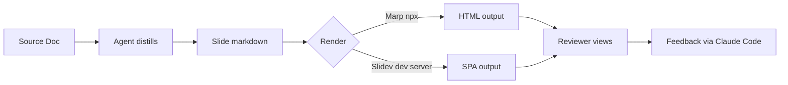

# Markdown Slide Deck Tooling

Finding the best tool for agent-authored slide decks

<style>
.slidev-layout.cover {
  position: relative;
}
.slidev-layout.cover::before {
  content: '';
  position: absolute;
  inset: 0;
  background: rgba(0, 0, 0, 0.55);
  z-index: 0;
}
.slidev-layout.cover > * {
  position: relative;
  z-index: 1;
}
</style>

---

# The Problem

Project docs are written **for agents** — dense, detailed, structured for
implementation.

Human reviewers need a faster path to the signal.

**Goal:** An agent writes lightweight slide markdown → tooling renders it →
reviewer clicks through in minutes.

**Key constraints:**

- Low agent authoring effort
- Mermaid diagram support
- Minimal setup (no complex build pipeline)
- Browser-based output

---

# Candidates Evaluated

Three tools considered:

| Tool       | Agent Effort | Mermaid                | Setup               |
| ---------- | ------------ | ---------------------- | ------------------- |
| **Marp**   | Very low     | Plugin (needs testing) | `npx` one-liner     |
| **Slidev** | Low–Medium   | Native, zero config    | Dev server required |
| Reveal.js  | Medium–High  | Plugin                 | Moderate            |

> Reveal.js eliminated early — too much HTML surface area for pure-markdown
> workflows.

---

# Marp

Markdown Presentation Ecosystem

**Strengths:**

- Plain markdown + `---` dividers = valid Marp input
- Single command: `npx @marp-team/marp-cli slide.md --html`
- No project setup, no dev server
- VS Code extension for live preview
- Output: HTML, PDF, PPTX

**Weakness:**

- Mermaid requires `--html` flag + inline script workaround — not built-in

---

# Slidev

Vue-powered slides by Anthony Fu

**Strengths:**

- **Mermaid built-in** — just write a `mermaid` code block
- Hot-reload dev server
- Interactivity: click-to-reveal, Vue components, presenter mode
- Natural path to clickable option selection

**Weakness:**

- Requires a running dev server + project directory
- More setup than a single `npx` command
- Vue features increase agent authoring complexity (agents should avoid them)

---

# The Deciding Variable

```
If Marp Mermaid plugin is low-friction → use Marp (simplicity wins)
If Marp Mermaid is awkward           → use Slidev (native support wins)
```

**Philosophy match:** Marp most closely mirrors the `html-mockup-prototyping`
approach — single file, npx, no build step.

**Interactivity headroom:** Only Slidev has a credible path to clickable
decision slides.

---

# Prototype Flow (Mermaid Test)



---

# Open Questions

Things that remain unresolved — flag any you want to explore further.

<TellMeMore id="marp-mermaid" topic="How hard is Marp's Mermaid plugin to configure?" />
<TellMeMore id="slidev-hosting" topic="Can Slidev output be hosted as a static site?" />
<TellMeMore id="agent-workflow" topic="What does the full agent-to-slide workflow look like in practice?" />

---

# Decision: Which tool?

<MultiChoice
  id="tool-choice"
  question="Which slide tool should we adopt?"
  :options="[
    'Marp — simplicity and zero setup wins, skip Mermaid for now',
    'Slidev — native Mermaid + interactivity justifies the setup cost',
    'Investigate further before deciding'
  ]"
/>

---

# Decision: Where do slide files live?

<MultiChoice
  id="file-location"
  question="Where should slide source files live in the doc structure?"
  :options="[
    'docs/projects/<name>/artifacts/ — alongside other project artifacts',
    'docs/slides/ — a new dedicated folder type',
    'Ephemeral — generated on demand, not committed to the repo'
  ]"
/>

---

# Decision: Should slide files be committed?

<MultiChoice
  id="commit-slides"
  question="Should generated slide files be committed to the repo?"
  :options="[
    'Yes — commit the .md source, treat it like any other project doc',
    'No — generate on demand from source docs, do not commit',
    'Commit the .md source only, not the rendered HTML'
  ]"
/>

---

# Feedback Summary

Your selections — copy and paste back to the agent.

<FeedbackSummary />
